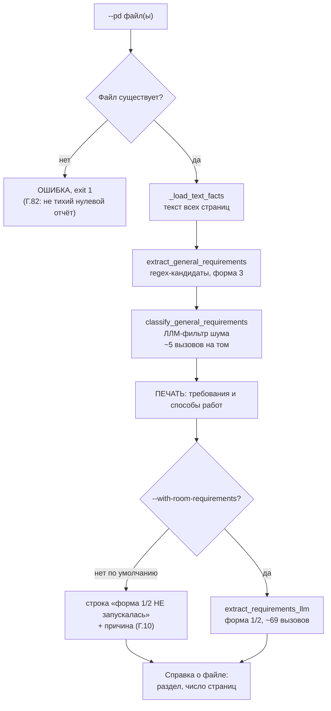
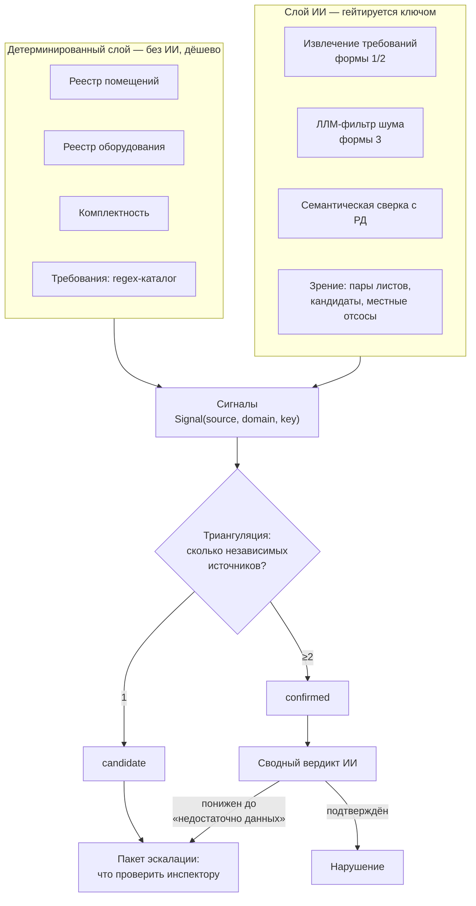

# Структура программы и последовательность действий

Прослежено по коду (`registry_diff.py`, `triangulated_pipeline.py`,
`main.py`), а не по докстрингам — они в этом проекте уже дважды отставали
от реального поведения (Г.75, Г.82). Порядок шагов ниже — тот, в котором
они физически выполняются.

Читать после `CONTEXT.md` (там — на каком этапе работа и какие правила Г.N
применимы сейчас). Здесь — как устроена сама программа.

---

## 1. Главная идея архитектуры

Программа — **не один анализатор, а набор независимых источников
сигналов, которые сходятся в триангуляции.**

Каждый источник смотрит на документы под своим углом (реестр помещений,
реестр оборудования, текстовые требования, геометрия трасс, таблица
воздухообменов, зрение по чертежу) и выдаёт находки в общем формате
`Signal(source, domain, key, detail)`. Дальше `triangulate()` группирует
их по ключу и помечает `confirmed`, только если находку независимо
подтвердили **≥2 разных источника**. Один источник — `candidate`, и на
него строится пакет эскалации: что уже известно, чего не хватает, что
проверить инспектору.

Отсюда два следствия, которые объясняют почти всё устройство кода:

- **Источники не зависят друг от друга** — можно выключить любой, и
  остальные продолжат работать. Поэтому шаги гейтируются по отдельности
  (нет ключа ИИ → выключены дорогие; нет РД → выключены сравнивающие).
- **Программа последовательна.** Источники выполняются друг за другом в
  фиксированном порядке, деля один лимит запросов к провайдеру. Дорогой
  шаг, стоящий раньше, забирает бюджет у того, что идёт после — это не
  теория, а измеренная причина сбоя 429 (Г.78/Г.83).

---

## 2. Два бэкенда — не перепутать

| | `packages/backend/` | `packages/api/` + `analysis/` + `llm_core/` |
|---|---|---|
| Что это | **Реальный движок сравнения документов** | Старый демо-движок CRM |
| Порт | 8010 | 8000 |
| Вся механика Приложения Г | да | нет |
| Куда идут правки по требованиям | **сюда** | не сюда |

Дальше речь только о `packages/backend/`.

---

## 3. Точки входа

| Вход | Что запускает | Когда нужен |
|---|---|---|
| `scripts/summarize_requirements.py` | Только извлечение требований из ПД | **Текущий этап.** РД нет |
| `scripts/registry_diff.py --kind all` | Полная цепочка `run_triangulated` | Когда появится РД |
| `scripts/registry_diff.py --kind <узкий>` | Один источник: `rooms`, `equipment`, `requirements`, `routing`, `mo`, `composition` | Точечная отладка |
| `scripts/run_all_disciplines.py` | Авто-классификация всех PDF в папке → `--kind all` по каждому разделу | Пакетный прогон комплекта |
| `POST /triangulated-runs` | `triangulated_pipeline.run_triangulated_analysis` | Фронтенд «Карта внимания» |

---

## 4. Последовательность текущего этапа — `summarize_requirements.py`

Четыре шага, из них один вызывает ИИ. Ни одного обращения к РД.



Почему форма 1/2 по умолчанию выключена — см. §7.

---

## 5. Последовательность полной цепочки — `--kind all` (`run_triangulated`)

Восемнадцать шагов в жёстком порядке. Колонка «Нужно» — что должно быть,
иначе шаг пропускается с видимой строкой (Г.10), а не молча.

| # | Шаг | Модуль | Нужно | ИИ |
|---|---|---|---|---|
| 1 | Загрузка ПД и РД, извлечение фактов | `documents.py` | — | нет |
| 2 | **Гейт**: пустая сторона → «ПРОГОН НЕДЕЙСТВИТЕЛЕН», стоп | `registry_diff` | — | нет |
| 3 | Сверка реестров помещений | `room_cross_check.py` | РД | нет |
| 4 | Сверка реестров оборудования | `equip_cross_check.py` | РД | нет |
| 5 | Комплектность по «Составу документации» | `composition_registry.py` | — | нет |
| 6 | Требования формы 1/2 из прозы ПД | `requirement_llm_extract.py` (или regex) | — | **да, ~69** |
| 7 | Каталог формы 3 + ЛЛМ-фильтр шума | `requirement_registry` + `requirement_llm_filter` | — | **да, ~5** |
| 8 | Сверка формы 1/2 с текстом РД | `requirement_cross_check.py` | РД | нет |
| 9 | Сверка формы 3 по токену (ГОСТ/марка) | `requirement_cross_check.py` | РД | нет |
| 10 | **Семантическая сверка формы 3 с РД** | `requirement_text_verify.py` | РД + ключ | **да, сотни–1500** |
| 11 | Сбор сигналов: помещения, оборудование, требования, комплектность | `triangulation.py` | — | нет |
| 12 | Граф маршрутизации трасс | `routing_diff.py` | `--rooms` или автовыбор ≤15 | **да, ~6 с/лист** |
| 13 | Местные отсосы (таблица воздухообменов) | `ventilation_mo.py` | ключ + список помещений | **да, 1/страница** |
| 14 | Прямое сравнение листов ПД↔РД по паре | `run_page_pair_comparison` | РД + ключ | **да, 121–213 пар** |
| 15 | Проверка кандидатов зрением по листу РД | `vision_page_compare.py` | РД + ключ | **да** |
| 16 | **Триангуляция**: ≥2 источника → `confirmed` | `triangulation.py` | — | нет |
| 17 | Пакеты эскалации на `candidate` | `escalation.py` | — | нет |
| 18 | Сводный вердикт по каждому ключу | `verdict_synthesis.py` | ключ | **да, 1/ключ** |
| 18б | Досчёт: `confirmed`, понижённые сводом до «недостаточно данных» | `escalation.py` | ключ | нет |



---

## 6. HTTP-путь — частичное зеркало, не полное

`POST /triangulated-runs` (`triangulated_pipeline.py`) повторяет тот же
порядок источников, но **три шага в нём отсутствуют физически** — проверено
поиском по коду, не по описанию:

| Шаг CLI | Есть в HTTP? |
|---|---|
| Семантическая сверка с РД (№10) | **нет** |
| Местные отсосы (№13) | **нет** |
| Зрение по кандидатам (№15) | **нет** |
| Прямое сравнение листов (№14) | **нет** (помечено в `not_run`) |

Пропущенные шаги честно перечисляются в поле `not_run` ответа — то есть
клиент видит, чего не было, а не получает молчаливо неполный результат.
При правке любого шага помнить: **CLI и HTTP — два разных вызывающих
кода**, фикс в одном не доезжает до другого автоматически (ровно так
ЛЛМ-фильтр год не работал в самом сервисе, Г.75).

---

## 7. Что чем гейтируется — таблица решений

| Чего нет | Что выключается | Что продолжает работать |
|---|---|---|
| **РД** (текущий этап) | Шаги 3, 4, 8, 9, 10, 14, 15 — всё сравнивающее | Извлечение требований, комплектность |
| **Ключа ИИ** | Шаги 6, 7, 10, 12–15, 18 | Весь детерминированный слой, regex-каталог |
| **`--rooms`** | Шаги 12, 13 | Всё остальное |
| Ключ есть, `--rooms` нет | — | Автовыбор ≤15 помещений с расхождением в реестре |

**Главное правило приоритета (Г.83).** Программа последовательна, все
шаги делят один лимит запросов. Поэтому на текущем этапе форма 1/2
выключена по умолчанию: на 177-страничном томе она стоит **69 вызовов
против 5** у формы 3, а даёт ноль — она собирает только требования с
привязкой к номеру помещения, что нужно автосверке с РД (шаг 8), которой
сейчас нет. Пока этот шаг стоял первым, он выбирал лимит частоты до того,
как очередь доходила до нужного результата.

---

## 8. Слои модулей

```
Извлечение          documents.py · rooms.py · equipment.py · material.py
из PDF              classification.py · table_registry.py · composition_registry.py

Реестры и           requirement_registry.py (формы 1/2/3)
каталоги            requirement_llm_extract.py · requirement_llm_filter.py

Сверка ПД↔РД        room_cross_check.py · equip_cross_check.py
                    requirement_cross_check.py · requirement_text_verify.py
                    routing_diff.py · ventilation_mo.py

Зрение              vision.py · vision_page_compare.py · visual_prefilter.py
                    matching.py · router.py

Свод                triangulation.py → escalation.py → verdict_synthesis.py

Инфраструктура      llm.py (единая точка ВСЕХ HTTP-вызовов обоих
                    провайдеров: ретрай 429, потолок задержки, TLS)
```

Ключевая деталь: `llm.py::_post_json` — **единственная** точка, через
которую идут все вызовы обоих провайдеров (получение токена, загрузка
файла, чат). Всё, что касается сети — ретраи, таймауты, проверка
сертификата — правится там, а не в вызывающих модулях.

---

## 9. Как программа сообщает о сбоях

Это не деталь реализации, а следствие правила Г.10 («тишина никогда не
означает "чисто"») — и каждый пункт здесь появился после реальной потери
времени:

- **Сорванный вызов ИИ печатается сразу**, построчно, а не превращается в
  пустой результат. До этого 100%-ный отказ связи выглядел точно так же,
  как «модель со всем согласна» (Г.77 — три дня отладки промпта, в котором
  не было ошибки).
- **Пропущенный шаг печатается явной строкой** с причиной, в CLI — текстом,
  в HTTP — полем `not_run`.
- **Отброшенные данные считаются**: сколько кандидатов отсеял фильтр,
  сколько требований отброшено из-за отсутствия помещения (Г.83), сколько
  листов не прочитано.
- **Пустая сторона останавливает прогон** с пометкой «ПРОГОН
  НЕДЕЙСТВИТЕЛЕН» — чтобы чистый отчёт из нулей нельзя было принять за
  результат.

Если в выводе есть строка `ВНИМАНИЕ: N из M кандидатов НЕ получили вердикт
ЛЛМ вообще` — **результат недостоверен**, связь рвётся, и никакие выводы о
качестве модели по нему делать нельзя.
